# 用进化看新冠病毒的起源
## [引言](#introduction)
## [序列分析和进化树入门](#introduction)
## [1 和新冠病毒nCoV2019最近的病毒是什么？穿山甲是中间宿主吗？](#question1)
## [2 nCoV2019和RaTG13到底有多近？](#question2)
## [3 nCoV2019是从RaTG13在实验室进化来的吗？](#question3)
## [4 nCoV2019的Spike蛋白有四个插入序列，怎么解释？是人为的吗？](#question4)
## [5 新冠病毒的S蛋白有个插入序列形成了Furin蛋白酶切位点，可能增强了病毒的感染力。这么精巧的短序列插入难道不是人为的吗?](#question5)
## [6 nCoV2019是从哪里来的呢？](#question6)
## [7 nCoV2019病毒毒株2013年就收集了，为什么2020年才发表基因组和文章？](#question7)
## [附录](#apendix)

## Introduction 
## 引言
前一段时间自媒体和社交网上流传关于新冠病毒的阴谋论（conspiracy theory）。阴谋论声称新冠病毒是在实验室人工改造而来的，不可能是从自然界中进化来的。我收集了一些阴谋论的观点，查阅了相关科学文献和资料，做了一些简单的数据分析。在这里，我用进化论来解答关于新冠病毒起源的一些疑问并反驳阴谋论的观点。文章分为八个部分。第一部分科普序列分析和进化树的入门知识，其余的部分回答了七个问题。为了便于理解，我给前五个问题配了幻灯片。

## 序列分析和进化树入门
如果我们要知道物种之间的亲缘关系，我们可以比较物种的相似性。比如，人和猴子长的比人和猫更像，所以我们可以得出这样的结论：在进化史上人和猴子更近。物种的信息储存在DNA中（DNA就像生物的硬盘）。DNA有四种碱基 ATGC。ATGC可以按不同的顺序排列组合，形成每个物种特有的基因组（Genome）。人的基因组有30亿个碱基，nCoV2019病毒基因组小多了，只有29000个碱基。

通过比较DNA序列的相似性，我们可以做亲子鉴定，查家族史，或者确认嫌疑犯。同样，通过比较DNA序列的相似性我们可以判断物种之间的亲缘关系。DNA可以编码蛋白质，蛋白质有20种氨基酸。和DNA一样，同一个蛋白质在不同的物种中有不同的氨基酸序列。我们也可以通过比较蛋白质序列的相似性，判断物种的亲缘关系。比如我们可以通过比较血红蛋白的氨基酸序列来判断动物之间的亲缘关系（图1）。

序列比对（sequence alignment）是把不同物种中对应的碱基或者氨基酸排列起来。序列比对是生物信息学（Bioinformatics）最基础也是最重要的分析手段之一。有了序列比对，我们就可以研究基因突变，并且在此基础上计算序列的相似性（sequence similarity），做进化树（phylogeny），判断物种的亲缘关系 （Evolutionary relationship）。

我们用血红蛋白做例子来解释一下这几个基本概念（图1）。图1左边是进化树，右边是蛋白质序列比对。血红蛋白有几百个氨基酸，这里只用14个氨基酸来举例说明。人（human）和猿（gibbon）血红蛋白序列最相似，只有一个氨基酸不一样。第八个氨基酸，人是T，猿是N。其他13个氨基酸都一样。所以人和猿的蛋白质序列相似性是13/14 = 92.8%。人和狒狒（baboon）的血红蛋白有三个氨基酸不一样（第8，9和78个氨基酸），所以相似性要小一些，是11/14 = 78.5%。 通过这种成对（pair-wise）比较，我们就可以构建出图1左边的进化树，看出物种之间的远近关系。

进化树和家谱类似。家谱记载的是家族成员的亲缘关系，而进化树反映的是物种之间的亲缘关系。如果把进化树中物种比做树叶，那么树根就是所有物种的共同祖先。树枝则代表进化的历程，树枝越长，物种变化的就越多。进化树有个时间轴，在进化树中离树根越近，时间越早，离树叶越近，时间越晚（图1）。两个物种在进化树中树枝的分叉点是它们的共同祖先。比如，人和猿在图1进化树的A点分叉，A点就代表人和猿的共同祖先。人和狒狒在B点分叉，B点就代表人和狒狒的共同祖先。因为进化树中B点在先，A点在后，所以人和狒狒在进化中分离在先，人和猿分离在后， 我们可以由此得出结论人和猿在亲缘关系中比人和狒狒更近。理解了这一点，就可以理解科学文章中进化树。

我们解读进化树的时候有一个常见的误区，需要澄清一下。我们不能说猴子是人的祖先。正确的说法是人和猴子有共同的祖先。说人是从猴子进化来的就像说你堂兄是你的祖先一样滑稽 😂。正确的说法是你和你的堂兄有共同的祖先（同一个爷爷）。

*图1:血红蛋白的序列分析。图片取自https://mbio.asm.org/content/9/6/e01524-18。*

## Question1
## 和新冠病毒nCoV2019最近的病毒是什么？穿山甲是中间宿主吗？
通过比对病毒的29000个碱基的相似性，构建出图2的进化树。红色方框中的是新冠病毒，箭头指的是云南蝙蝠中发现的RaTG13病毒。如果从新冠病毒出发沿着树枝向树根方向移动，我们就可以找到新冠病毒和各类病毒的共同祖先。图中红点是新冠病毒和RaTG13病毒的共同祖先。蓝色的点代表新冠病毒和其它各类病毒的共同祖先。从图中可以看出，和新冠病毒亲缘关系最近的病毒是RaTG13，这是因为它们有着最近或者时间轴上最晚的共同祖先。

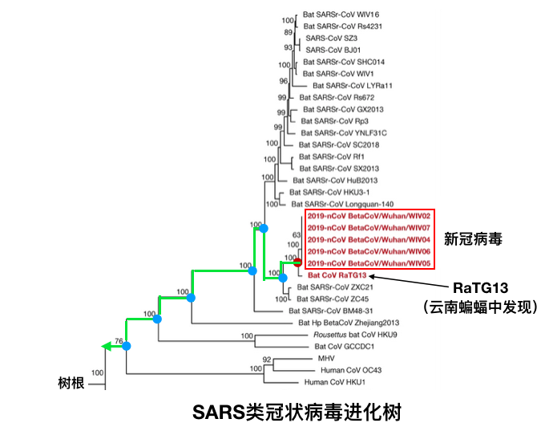

*图2：新冠病毒的进化树。这个进化树是通过比对病毒的基因组（29000个碱基）来构建。图2中进化树中的数字是可信度，数字越大，可信度越高。100是最高值。从图中可见，这个进化树的分辨率和可信度都是很高的。图取自于https://www.nature.com/articles/s41586-020-2012-7。*

当然，其他科学家也构建出类似的进化树，得出的结论都一致，比如这个被科学杂志（Science）引用的进化树（图3）（https:/www.sciencemag.org/news/2020/01/mining-coronavirus-genomes-clues-outbreak-s-origins）。

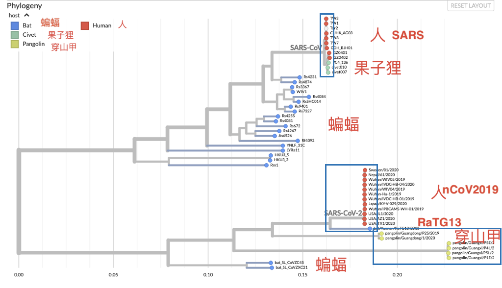

*图3: 冠状病毒进化树。图片来源：https://nextstrain.org/groups/blab/sars-like-cov?c=host*

图3的信息量也很大。比如，你可以看出2002年的SARS和果子狸病毒最近，连接它们的树枝非常短，所以我们可以很有把握地推测2002年SARS是果子狸传给人的。蝙蝠病毒RaTG13和nCoV2019虽然亲缘关系最近，但比起2002年的SARS和果子狸病毒的亲缘关系，还是差了很远。所以nCoV2019应该还有未知的中间宿主。目前收集的穿山甲病毒样本（图中绿点）和nCoV2019相距更远，所以现有的数据不支持穿山甲是nCoV2019的中间宿主。

[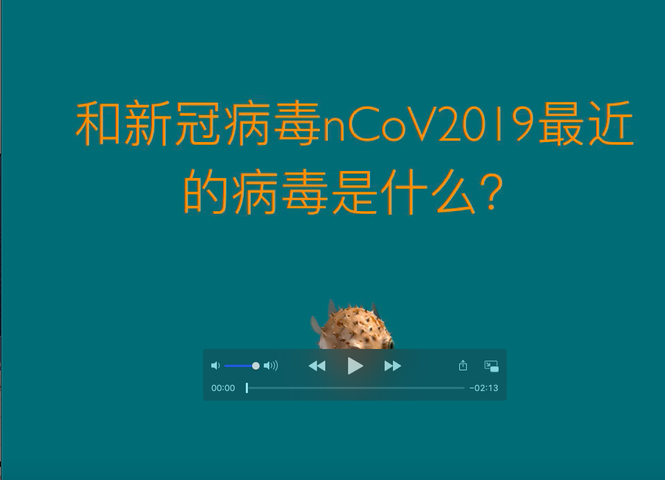](https://youtu.be/ksx-tu0jfCo "question 1")

## Question2
## nCoV2019和RaTG13到底有多近？
通过比对病毒的29000个碱基,我们可以看到两个病毒有96%的相似性（图4）。换句话说，新冠病毒和RaTG13基因组相差 4%。冠状病毒的突变率是每年 0.1% (JHU 公共卫生学院 http://www.centerforhealthsecurity.org/resources/COVID-19/200128-nCoV-whitepaper.pdf ）。所以它们之间相差4% / 0.1% = 40年。如果新冠病毒是从RaTG13在实验室进化来的，那么RaTG13毒株应该早在1979年就已被实验室收集了。这个说法显然站不住脚。

*图4: 新冠病毒nCoV2019和RaTG13的DNA序列比对。序列比对方法：NCBI BLASTN*

[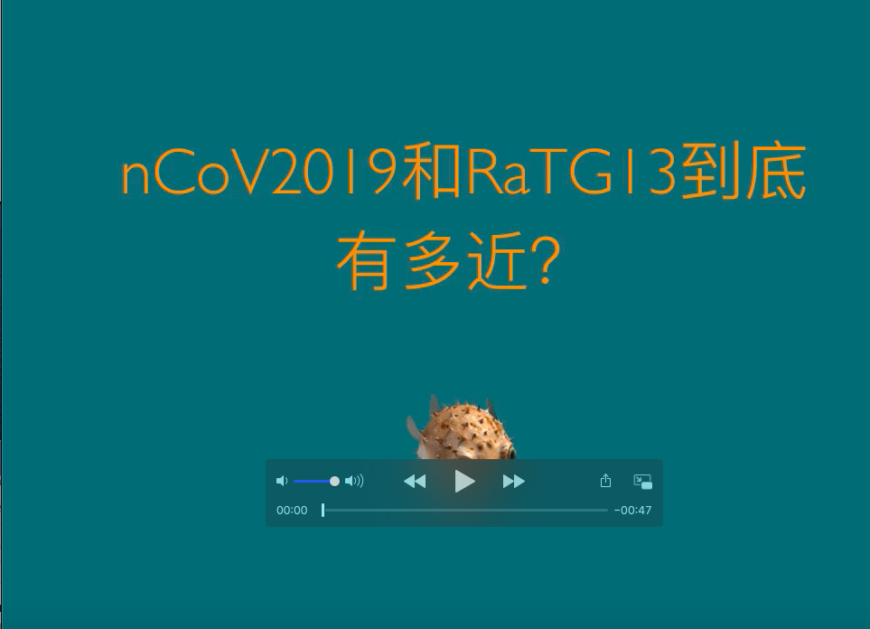](https://youtu.be/elGtvCsPBd8 "question 2")

## Question3
## nCoV2019是从RaTG13在实验室进化来的吗？
如果nCoV2019是从RaTG13在实验室人工进化来的，那么时间上RaTG13在先，nCoV2019在后。换句话说，RaTG13是祖先型（ancestor），nCoV2019是子代型（descendent）。在回答这个问题之前，我们先看一下如果我们有已知的祖先型和子代型病毒，进化树如何告诉我们谁是祖先型，谁是子代型的。

我们来看一个例子。图5中的进化树描述了在美国早期传染的新冠病毒的亲缘关系。每个圆点代表一个毒株。箭头指的红色的点是美国的第一例病人WA1（采样时间01/19/2020）。其余红色的点代表由第一例病人传染的其他病人（采样时间02/20/2020以后）。在这个例子中，第一例病人的病毒WA1是祖先型，其它病人的病毒是由WA1进化来的子代型。

图5的横坐标是时间轴，左边早，右边晚。由此可见，图5的进化树非常准确地反映了祖先型和子代型在时间上的先后顺序（图中绿箭头）。

*图5: 美国早期传染的nCoV2019病毒进化树。进化树是基于病毒的整个基因组。图片来源https://nextstrain.org/ncov?label=clade:B1&m=div*

看懂了上面这个例子，现在我们可以来回答nCoV2019是不是在实验室从RaTG13进化来的这个问题。如果nCoV2019是从RaTG13在实验室进化来的，那么RaTG13是祖先型，nCoV2019是子代型。进化树应该显示时间上先后次序。

我从NCBI下载了图2中四个病毒的基因组：新冠病毒nCoV2019和三个与它最近的蝙蝠病毒RaTG13，SL-CoVZXC21, SL-CoVZC45。因为新冠病毒基因组基本一样，所以我只选了其中的一个代表。经过序列比对后，用最大似然法（maximum likelihood）构建出图6A中的进化树。从图6A中可以看出，nCoV2019和蝙蝠病毒RaTG13在时间轴上处与同一时间点（图中竖向虚线），并没有图5中病毒祖先型和子代型那样的时间上的先后关系。因此，基因组进化树分析表明，新冠病毒nCoV2019不是从RaTG13人工或自然进化而来。

为了进一步验证这个结论，我用电脑模拟（simulate）了一个RaTG13的子代型。模拟过程很简单，只需随机改变RaTG13 29000个碱基中的1160个碱基，这样就得到相似性是96%的RaTG13的子代型。用上面同样的方法构建出图6B中的进化树（详细方法请看附录）。请注意图6B中两条竖向虚线清楚地显示出祖先型（RaTG13）和RaTG13模拟子代型时间上的先后关系。这个模拟实验表明，如果存在祖先型和子代型的进化关系，进化树是可以准确反映出这种关系的。新冠病毒和RaTG13大约二十年前就分家，然后各自独立进化。说新冠病毒是从RaTG13进化而来，就如说一个人的堂兄是这个人的祖先一样滑稽可笑 😂。

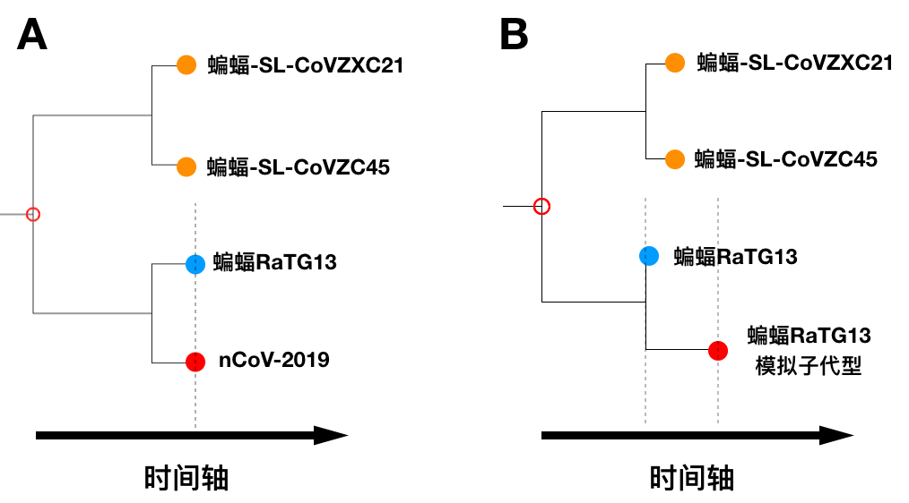

*图6. A.进化树显示新冠病毒nCoV2019不是从RaTG13人工或自然进化而来。B.电脑模拟显示，进化树可以准确反映出模拟的RaTG13子代型是从RaTG13进化而来的。*

[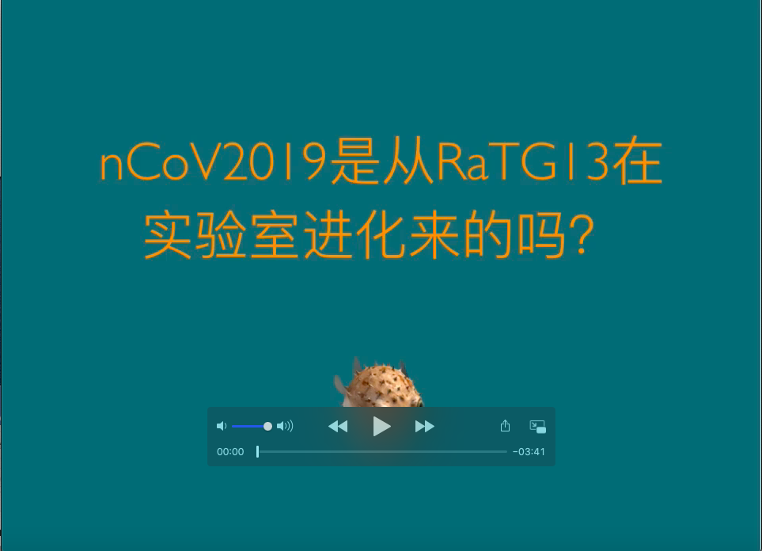](https://youtu.be/19uQLu9wYks "question 3")

## Question4
## nCoV2019的Spike蛋白有四个插入序列，怎么解释？是人为的吗？
最先指出这四个插入序列的是一篇没有经过同行评审的预印文章(https://www.biorxiv.org/content/10.1101/2020.01.30.927871v1)。 这篇文章声称（claim）这四个插入序列和HIV的序列高度相似，因此非同寻常。于是阴谋论者引用这篇文章，说病毒是人工改造的，不可能是自然进化来的。

首先要说的是，这篇预印文章的分析方法犯了非常低级的错误。所以几天之内就撤了稿。这四个插入序列都很短，在其它物种（各种动物，细菌和病毒）中都存在，说车载斗量都不过分。其中第三和第四个序列和HIV序列相差甚远，可以说和HIV没有半毛钱的关系。反驳（打脸）这篇文章的科学家很多。比如经同行评审后正式发表的文章有这篇 （https://www.ncbi.nlm.nih.gov/pmc/articles/PMC7033698/）。 

好吧，既然这四个插入序列和HIV无关。那么，它们究竟是从哪里来的呢？
关于这个问题，Trevor Bedford 的Twitter解释得很好。 Trevor Bedford是Fred Hutchinson Cancer Research Center的教授(https://bedford.io/blog/)。 他的专长是用基因组研究新冠病毒流行病史。他的研究推测出美国华盛顿州从很早就已出现社区感染（https://www.nytimes.com/2020/03/01/health/coronavirus-washington-spread.html）。

我们来看一下他是如何解释的。他解释的原文在这里（https://threadreaderapp.com/thread/1223666856923291648.html）。

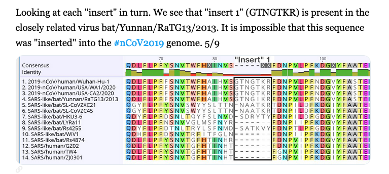
>“第一个插入序列在云南蝙蝠病毒RaTG13也有，所以这个序列不可能是人工插入到nCoV2019病毒的。”

>“第二个插入序列根本不是插入序列，只是序列比对技术错误（artifact）。序列本身在蝙蝠病毒RaTG13和其它相近的蝙蝠病毒也存在。这个序列根本不可能是人工插入到nCoV2019病毒的。”

>“第三个插入序列也在蝙蝠病毒RaTG13存在，所以这个序列也不可能是人工插入nCoV2019病毒的。”

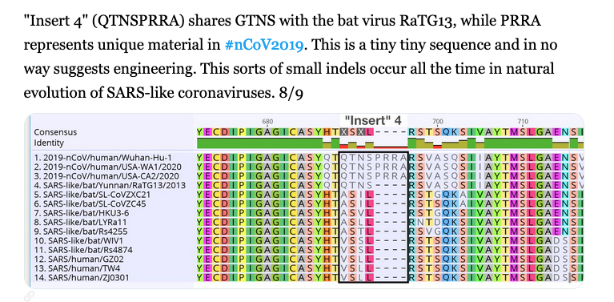
>“PRRA是个很小很小的序列，根本不能说明是人工所为。这种小的序列插入或缺失在SARS类冠状病毒自然进化中随时都会发生。”

下面我来进一步解释一下。自然进化的原材料是基因突变。基因突变有好多种，包括单个碱基突变（点突变），序列插入或缺失等等。正如Bedford教授所说，序列插入或缺失在SARS类冠状病毒自然进化中随时都会发生。图7截取自2010年发表在美国微生物协会病毒学杂志的一篇文章：SARS病毒Spike或者S蛋白质的序列比对。可以清楚地看出和蝙蝠病毒相比，SARS和果子狸病毒都有序列插入。这个例子清楚地表明序列插入是自然进化中经常发生的事情。如果按照阴谋论的解释，这个SARS和果子狸病毒的序列插入也是应该是人为的啰。显然逻辑不通！

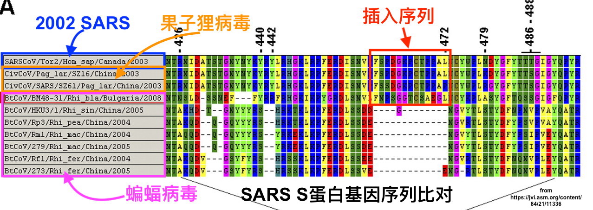

*图7. SARS类病毒Spike或者S蛋白质的序列比对。图片来源 https://jvi.asm.org/content/84/21/11336*

综上所述，没有证据支持这些序列是人工插入。相反，所有证据都支持这些序列是自然进化而来。

## Question5
## 新冠病毒的S蛋白有个插入序列形成了Furin蛋白酶切位点，可能增强了病毒的感染力。这么精巧的短序列插入难道不是人为的吗？
第四个插入序列形成了Furin蛋白酶切位点，可能增强病毒的感染力。阴谋论的一个观点是，这么精巧的短序列插入是不可能在短时间内通过自然进化发生的。事实果真如此吗？Furin酶切位点广泛存在各种病毒中，包括冠状病毒, 禽流感病毒, 艾滋病毒，麻疹病毒。禽流感病毒也是一种RNA病毒，它的血凝素蛋白(Hemagglutinin，HA)相当于新冠病毒的S蛋白，负责和宿主细胞膜融合。血凝素蛋白经常通过突变获得Furin蛋白酶切位点。比如，2012年墨西哥爆发禽流感，导致两千万只鸡死于鸡瘟或被宰杀。这个禽流感病毒获得了包括Furin酶切位点在内的8个氨基酸的插入序列（图8）。获得这个突变以后，这个禽流感毒株不光在鸡身上毒性超强，而且从鸡传染给了人（Sun et al. 2016）。图9中进化树中橘红色方框中是墨西哥爆发禽流感毒株，有包括Furin酶切位点在内的插入序列。蓝色方框是从美国的鹅和珍珠鸡中分离的禽流感毒株，没有插入序列。进化树显示，这个插入序列是在不超过三年的时间，通过自然进化获得的(Kapczynski et al. 2013)。新冠病毒和RaTG13大约二十年前就分家，所以完全有足够的时间通过自然进化获得Furin酶切位点。

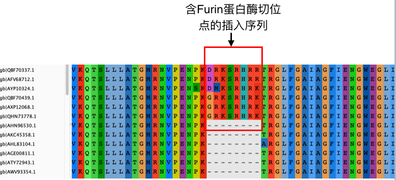

*图8. 禽流感病毒血凝素蛋白序列比对显示含Furin酶切位点在内的插入序列。*

*图9. 进化树显示，这个插入序列是在不超过三年的时间通过自然进化获得的。*

Sun et al. 2016 Virology. Jan 15;488:120-8. doi: 10.1016/j.virol.2015.10.032. Epub 2015 Nov 26.

Kapczynski et al. 2013 J Virol. 87(16):9086-96. doi: 10.1128/JVI.00666-13. Epub 2013 Jun 12.

[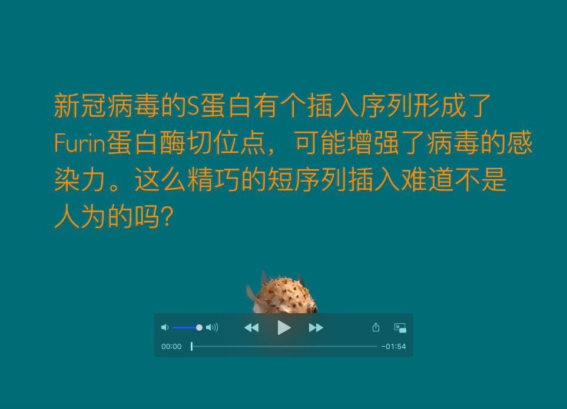](https://youtu.be/Q_KBj6Bh-kE "question 5")

## Question6
## nCoV2019是从哪里来的呢？
对这个问题我读到的最好最严谨的解释是3月17日发表在自然医学（Nature Medicine）的文章（https://www.nature.com/articles/s41591-020-0820-9）。

摘要翻译如下：
>We offer a perspective on the notable features of the SARS-CoV-2 genome and discuss scenarios by which they could have arisen. Our analyses clearly show that SARS-CoV-2 is not a laboratory construct or a purposefully manipulated virus

我们提出关于SARS-CoV-2（即nCoV2019）基因组的一些看法。我们探讨了病毒的起源。我们的分析清楚地表明nCoV2019病毒既不是实验室人工构造，也不是人工有意改造而来。

>Furthermore, if genetic manipulation had been performed, one of the several reverse-genetic systems available for betacoronaviruses would probably have been used19. However, the genetic data irrefutably show that SARS-CoV-2 is not derived from any previously used virus backbone20

如果这个病毒是经过人工基因改造，那么至少会用一种改造冠状病毒的逆向基因系统。但是，基因组数据毫无疑问地表明nCoV2019不带有任何已知的用于改造病毒的系统。

>Instead, we propose two scenarios that can plausibly explain the origin of SARS-CoV-2: (i) natural selection in an animal host before zoonotic transfer; and (ii) natural selection in humans following zoonotic transfer. We also discuss whether selection during passage could have given rise to SARS-CoV-2.

反而，我们提出两种可能性：1. 在动物中自然进化而来。2.从动物传到人后在人群中进化而来。我们也讨论了nCoV2019是否由实验室细胞培养选择而来。

>Although the evidence shows that SARS-CoV-2 is not a purposefully manipulated virus, it is currently impossible to prove or disprove the other theories of its origin described here. However, since we observed all notable SARS-CoV-2 features, including the optimized RBD and polybasic cleavage site, in related coronaviruses in nature, we do not believe that any type of laboratory-based scenario is plausible.

虽然证据表明nCoV2019不是人工有意改造来的，现在不可能证明或证伪其它的可能性（动物或者人群中自然进化，实验室泄漏）。但是，因为nCoV2019病毒基因组的显著特征（包括S蛋白优化的结合位点，多碱性氨基酸酶切位点（注：即上面提到的Furin蛋白酶切位点））在自然界中相关的冠状病毒中都存在，我们不相信任何源于实验室的解释是合理的。

## Question7
## nCoV2019病毒毒株2013年就收集了，为什么2020年才发表基因组和文章？
现在病毒分离，基因组测序都很容易，不是每发现一个新的病毒株都可以发文章。什么概念呢？NCBI的数据库有24万多个细菌类基因组，35447个病毒基因组（https://www.ncbi.nlm.nih.gov/genome/browse#!/prokaryotes/) 所以我觉得这没有什么奇怪的。我们实验室就有好些细菌基因组没有发表，也没有传到NCBI的数据库中。

## apendix
## 附录
[附录文件](Data/Readme)
